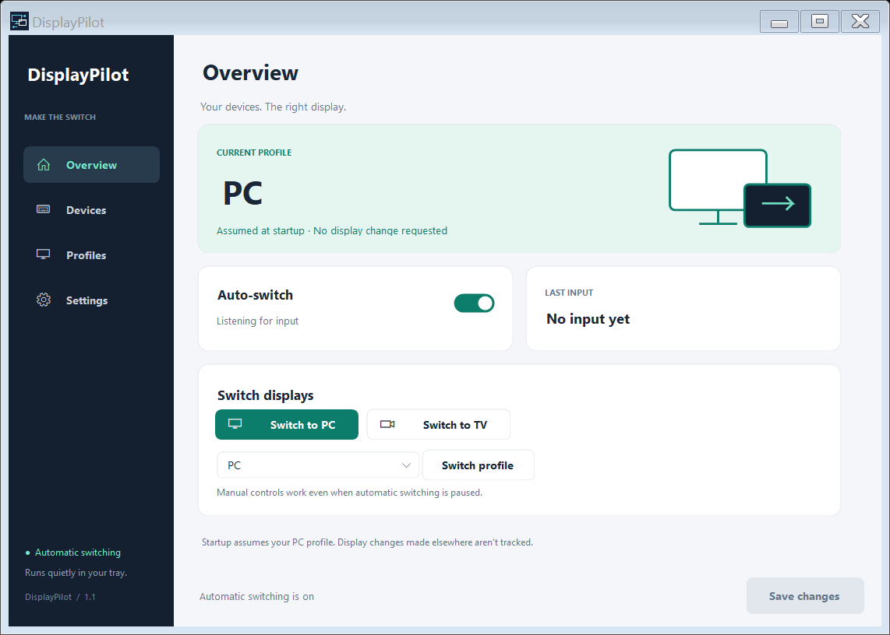

# DisplayPilot

Download DisplayMagician from its [official releases page](https://github.com/terrymacdonald/DisplayMagician/releases/latest). In Settings, use **Choose folder** to select its installation directory (usually `C:\Program Files\DisplayMagician`), or **Choose file** to select `DisplayMagicianConsole.exe`. Click **Save changes** to persist the selection. **Open DisplayMagician** launches the main application from that folder so you can create or edit display layouts.

A Windows tray utility that maps input devices to DisplayMagician profiles.

## Install and use
Run DisplayPilot-Setup.exe. Installation is per user and includes a Start Menu shortcut, uninstaller, and optional desktop/startup shortcuts. The application includes the .NET runtime. DisplayMagician must be installed separately. Exit the old DeviceDetector/DisplaySwitcher tray application before using DisplayPilot so two applications do not compete to switch displays.

Overview shows the last successfully requested profile and last keyboard/mouse input. Closing the window keeps the tray application running; use tray > Exit to stop. Every launch assumes the configured PC profile. It never queries CurrentProfile or switches displays at startup. Changes made outside DisplayPilot are not tracked.

Devices: refresh to enumerate attached raw-input devices. Edit friendly names and select any saved profile or Ignore. Multiple devices may use the same profile. New devices default to Ignore. Use Search to filter the list, Add device for manual entries, and Device details to edit an identifier or remove a device. An identifier can contain multiple alternatives separated by |. Matching is case-insensitive, first matching rule wins. Save mappings to activate edits.

Fresh installations start with no device assignments. Refresh Devices, assign the keyboards or mice you want to each profile, and save. Personal assignments remain in local settings and are not distributed in source or releases.

Profiles: Detect profiles reads %LOCALAPPDATA%\DisplayMagician\Profiles\DisplayProfiles.json without launching DisplayMagician. Add any exact saved profile name manually if detection is unavailable. New profiles appear in device dropdowns immediately. Save changes when you are ready to apply the draft. These names refer to existing DisplayMagician layouts; adding a name does not create a display layout. Renaming a profile updates its device mappings and PC/TV shortcuts automatically. Profiles still in use cannot be removed.

Settings: select DisplayMagicianConsole.exe, choose the profiles used by the PC and TV buttons, set cooldown (default 5 seconds), and configure minimized/startup behavior. Overview, Settings, and tray automatic-switch toggles save immediately. Other edits use the persistent Save changes button (or Ctrl+S). The footer shows unsaved changes, confirmations, and errors without interrupting work. Start with Windows uses the current user's Run registry key.

HID devices are enumerated, with generic Sony/Microsoft labels for recognized vendor IDs, and can be assigned for future support. Controller input activation is intentionally not enabled: idle HID reports and controller-specific dead zones require validation first. Xbox devices exposed only through XInput may not appear. Keyboard and mouse raw input remain the active switching sources.

## Settings
%LOCALAPPDATA%\DisplayPilot\settings.json

Defaults are created on first save. Settings survive uninstall/reinstall. Invalid JSON is backed up as settings.json.invalid-TIMESTAMP before defaults are used. Profile failures retain the prior assumed state and display a tray error. A failed attempt also incurs cooldown to prevent rapid retries. Manual switching bypasses cooldown, but never repeats the current profile.

## Build
Requires Windows x64, .NET 10 SDK, and Inno Setup 6 or newer.

    dotnet run --project tests\DisplayPilot.Tests.csproj -c Release
    dotnet publish DeviceDetector.csproj -c Release -r win-x64 --self-contained true -o publish --source https://api.nuget.org/v3/index.json
    ISCC.exe DisplayPilot.iss

Executable: publish\DisplayPilot.exe (keep the entire publish directory together).
Installer: installer\DisplayPilot-Setup.exe.

The installer and application are not code-signed. The custom icon is original vector-style artwork rendered into an ICO.

## Validation
Regression checks use synthetic device mappings to cover assumed-PC startup, no-op first desk events, alternate TV-keyboard identifiers, cooldown, pause, manual override, arbitrary profiles, Ignore, failed switches, concurrent requests, and JSON round trip. --smoke-test uses synthetic demo devices, renders all four pages and a compact layout, exercises profile renaming, saving, and device search, and exits without reading/writing personal settings, registering input, or invoking DisplayMagician. Hardware display changes require a final hands-on check with the desk devices and K600; automated checks do not physically exercise those devices.

## Downloads and releases

Download installers and portable builds from [GitHub Releases](https://github.com/cmdsreedev/DisplayPilot/releases/latest). See [RELEASING.md](RELEASING.md) for the tag-based release workflow and local packaging command. Personal settings and compiled output are excluded from Git.
